# Image Enhancement techniques using Opencv C++

## Description
Application for experimenting Image Enhancement techniques including point-wise transforming, histogram tranforming, sharpening, noise smoothing, homorphic filtering and video denoising(in-progress).

## Prerequisites

- [CMake](https://cmake.org/download/) (version 3.6.0 or higher)
- [OpenCV](https://opencv.org/releases/) (ensure the path is correctly set in `CMakeLists.txt`)
- A C++ compiler (Visual Studio 2022, GCC, Clang, etc.)

## Building the Project

### Clone the Repository

```sh
git clone https://github.com/SebastianKyle/Image-Enhancement.git
cd ImageEnhancement
```

## Build the project
- One can use the application directly using the pre-built Visual Studio Solution named 'ImageEnhancement' in 'out/build/Visual Studio' folder or the executable file in the 'out/build/Visual Studio/Debug' folder.
- Build visual studio solution in build folder (delete the 'out' folder first)
```sh
mkdir build
cd build
cmake ..
```
- Then compile the project based on the C++ compiler used (eg. Build ImageEnhancement solution in case of Visual Studio).

## Run application
- After building the project and solution, navigate to out/build/Debug folder (or whatever the folder you built in)
- Run the executable file
```sh
.\ImageEnhancement.exe -<args> <input-path> <output-path> <other-args>
```
- It is recommended to place input image in 'images' folder of the repo and set input path to the 'images' folder and output path to 'results/images' folder for running command.

## Point-wise transformation
- Log transform
```sh
.\ImageEnhancement.exe -image -log path/to/input/image.png path/to/output/image.png
```
Original | Log Transformed
:--------------------------:|:--------------------------:
 | 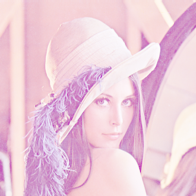
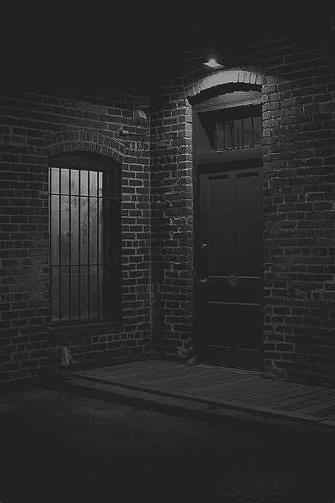 | 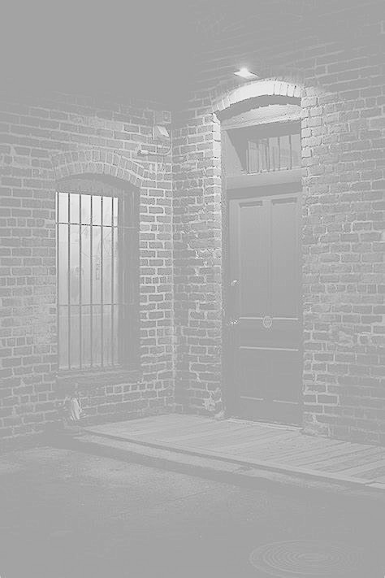

- Constrast stretching
```sh
.\ImageEnhancement.exe -image -constret path/to/input/image.png path/to/output/image.png
```
Original | Constrast stretched
:--------------------------:|:--------------------------:
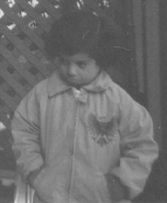 | 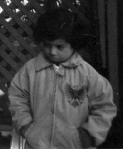

- Noise smoothing
  - Spatially adaptive noise smoothing
```sh
.\ImageEnhancement.exe -image -sns path/to/input/image.png path/to/output/image.png <kernel-size>
```

Original | Spatially Adaptive Noise Smoothed (kernel-size = 5)
:--------------------------:|:--------------------------:
 | 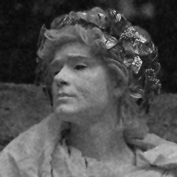
 | 
 
  - Median noise smoothing
```sh
.\ImageEnhancement.exe -image -median path/to/input/image.png path/to/output/image.png <kernel-size>
```

Original | Median Smoothed (kernel-size = 5)
:--------------------------:|:--------------------------:
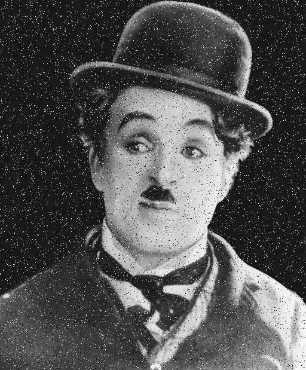 | 
 | 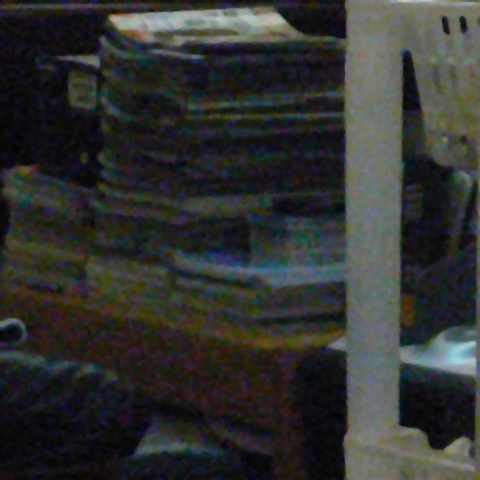

  - Bilateral filter
```sh
.\ImageEnhancement.exe -image -median path/to/input/image.png path/to/output/image.png <kernel-size> <sigma-b>
```

Original | Bilateral Smoothed (kernel-size = 21, sigma-b = 10.0)
:--------------------------:|:--------------------------:
 | 

- Sharpening

```sh
.\ImageEnhancement.exe -image -sharp path/to/input/image.png path/to/output/image.png <alpha>
```

Original | Sharpened (alpha = 1.8)
:--------------------------:|:--------------------------:
 | 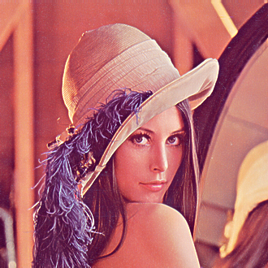

- Histogram equalizing

```sh
.\ImageEnhancement.exe -image -hiseq path/to/input/image.png path/to/output/image.png
```

Original | Histogram equalized
:--------------------------:|:--------------------------:
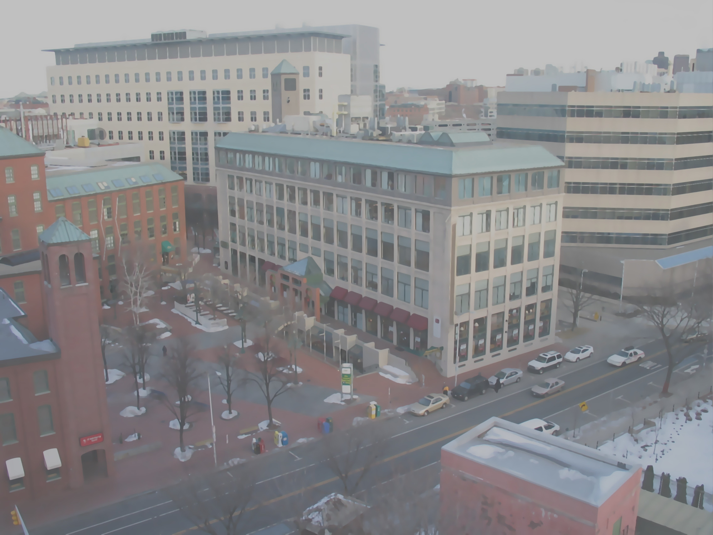 | 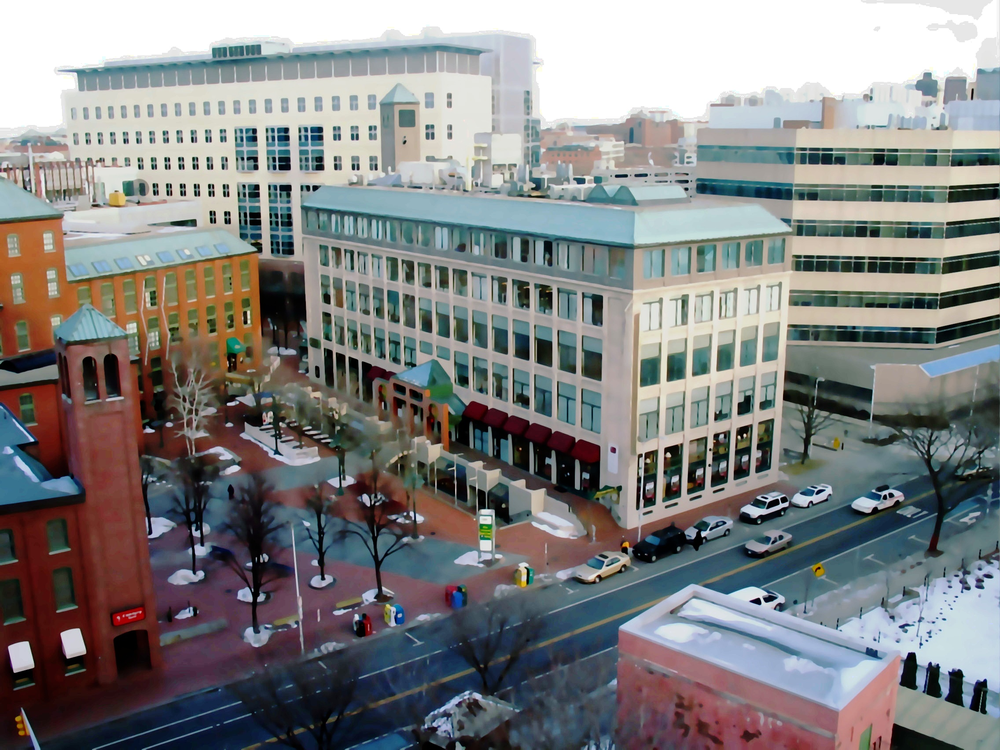
 | 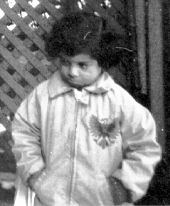

- Homomorphic filtering

```sh
.\ImageEnhancement.exe -image -homo path/to/input/image.png path/to/output/image.png <gamma-1> <gamma-2>
```

Original | Homorphic filtered (gamma-1 = 0.8, gamma-2 = 1.8)
:--------------------------:|:--------------------------:
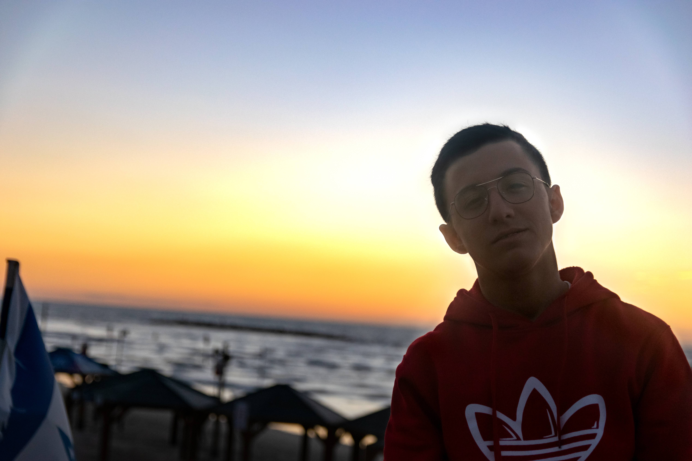 | 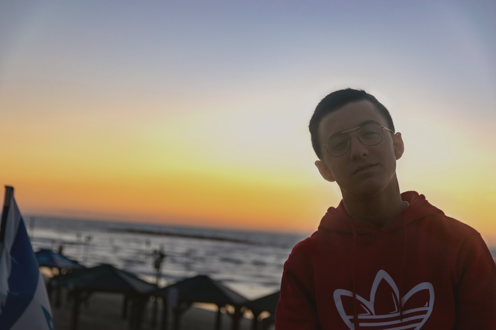
